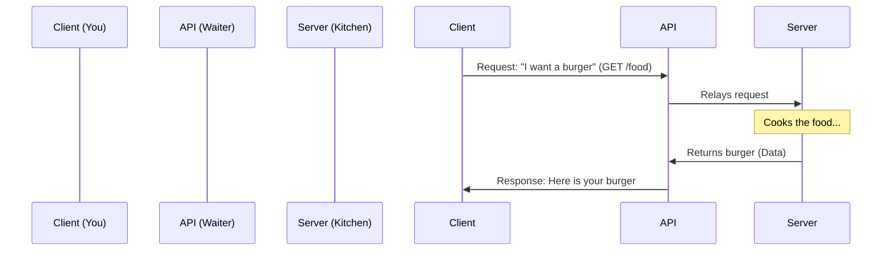

# Introduction to APIs

## What is an API?
**API** stands for **Application Programming Interface**.
Think of it as a **waiter in a restaurant**.

### The Restaurant Analogy 🍽️
1.  **You (The Client)**: You are sitting at a table with a menu. You want food, but you can't go into the kitchen and cook it yourself.
2.  **The Kitchen (The Server)**: This is where the food (data) is prepared.
3.  **The Waiter (The API)**: You tell the waiter what you want (your order). The waiter takes your request to the kitchen, the kitchen prepares it, and the waiter brings the food back to you.

### The Code Equivalent 💻
In code, an API is just a function that you call to get data from somewhere else.

#### JavaScript
```javascript
// You are the client calling the waiter (API)
async function orderFood() {
    const response = await fetch('https://api.restaurant.com/burger');
    const food = await response.json();
    console.log("Here is your:", food);
}
```

#### Python
```python
import requests

# You are the client calling the waiter (API)
response = requests.get('https://api.restaurant.com/burger')
food = response.json()
print("Here is your:", food)
```

### Visualizing the Flow 📊



## Why do we need them?
-   **Integration**: Allows different software to talk to each other (e.g., Uber using Google Maps).
-   **Security**: Hides the complex logic (the kitchen) from the user; you only see the menu.
-   **Efficiency**: You don't need to rebuild functionality that already exists (like payment processing with Stripe).

## Key Terms
-   **Client**: The one asking for data (Mobile App, Browser).
-   **Server**: The one providing data.
-   **Request**: The act of asking for something.
-   **Response**: The answer returned by the server.
